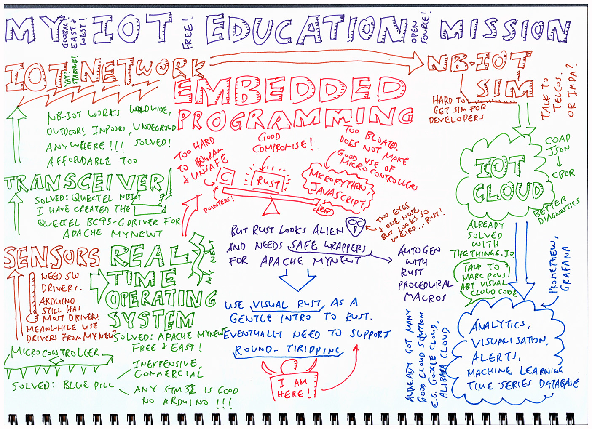

# "My 5-Year IoT Mission" presentation at Hackware 3 Dec 2019

  
[_Larger Version_](iot-mission-small.jpg)

## [1] About Me

I'm [Lup Yuen](https://lupyuen.github.io) and I teach IoT...

1. [_"I Teach IoT. Here’s what you’ll learn"_](https://medium.com/@ly.lee/i-teach-iot-heres-what-you-ll-learn-3e0d1b997dd0?source=friends_link&sk=ec31991f7245ccde1200dd950196a5e7)

I teach IoT because...

1. [_"IoT is a Bad Word"_](https://medium.com/@ly.lee/iot-is-a-bad-word-9003d9fab638?source=friends_link&sk=f7d58ebca338f326b6be8dcb79c7d6f5)

## [2] IoT Cloud

IoT Clouds are already stable and mature. Like Amazon Web Services...

1. [_"Push AWS IoT sensor data to Redshift with Kinesis Firehose"_](https://medium.com/@ly.lee/push-aws-iot-sensor-data-to-redshift-with-kinesis-firehose-385506264a00?source=friends_link&sk=bd45be8b48fbb328ed1d65d10a8d7c38)

1. [_"Transform and Import a JSON file into Amazon Redshift with AWS Glue"_](https://medium.com/@ly.lee/transform-and-import-a-json-file-into-amazon-redshift-with-aws-glue-3371006e03ca?source=friends_link&sk=a57bcec30f5b6b1c978dc4f35d8d6427)

1. [_"Connecting AWS Lambda Node.JS to Redshift or PostgreSQL? Try AWS Lambda Layers!"_](https://medium.com/@ly.lee/connecting-aws-lambda-node-js-to-redshift-or-postgresql-try-aws-lambda-layers-78e60c27f39b?source=friends_link&sk=84d0f78bddfece6049c2395741824e58)

thethings.io...

1. [_"Visualising BBC micro:bit sensors with thethings.iO"_](https://medium.com/@ly.lee/visualising-bbc-micro-bit-sensors-with-thethings-io-5689fb613531?source=friends_link&sk=a8cfc404362ecbe3a26823f6a70fa5cb)

1. [_"以 thethings.iO 來將 BBC micro:bit 感測器圖形化"_](https://medium.com/@ly.lee/%E4%BB%A5-thethings-io-%E4%BE%86%E5%B0%87-bbc-micro-bit-%E6%84%9F%E6%B8%AC%E5%99%A8%E5%9C%96%E5%BD%A2%E5%8C%96-4258b04dea6c?source=friends_link&sk=4d0250276797fe60533c058d25cdbe90)

1. [_"Realtime sensor data processing with thethings.io and Amazon Web Services Kinesis"_](https://medium.com/coinmonks/realtime-sensor-data-processing-with-thethings-io-and-amazon-web-services-kinesis-e12ebb022106?source=friends_link&sk=a57d58d346c283c79699efe384bca299)

Google Cloud...

1. [_"How To Build Your Sigfox Server (Version 1.0)"_](https://medium.com/@ly.lee/how-to-build-your-sigfox-server-version-1-0-6763732692fd?source=friends_link&sk=641f65c458ec59fa27dddbe7735b118a)

Alibaba Cloud...

1. [_"First Impressions of Alibaba Cloud (Aliyun)"_](https://medium.com/@ly.lee/first-impressions-of-alibaba-cloud-aliyun-688dc46fa9b8?source=friends_link&sk=0685f5028f4ce9575dfae9cc9515143d)

## [3] IoT Network

I taught IoT with the Sigfox network...

1. [_"Sigfox Teacher Answers Your Questions"_](https://medium.com/@ly.lee/sigfox-teacher-answers-your-questions-7e47122716dc?source=friends_link&sk=7668c0b2ecc6333cd60ff8e536501ebd)

1. [_"Connect STM32 Blue Pill to Sigfox"_](https://medium.com/coinmonks/connect-stm32-blue-pill-to-sigfox-28c6f91bddc1?source=friends_link&sk=d0f0d9f40e36badadfb04dc4c0846775)

1. [_"連接 STM32F103C8T6 Blue Pill 開發板與 Sigfox 物聯網"_](https://medium.com/@ly.lee/%E9%80%A3%E6%8E%A5-stm32f103c8t6-blue-pill-%E9%96%8B%E7%99%BC%E6%9D%BF%E8%88%87-sigfox-%E7%89%A9%E8%81%AF%E7%B6%B2-9fc6b01e616a?source=friends_link&sk=58e0604e547a7603411297babc9ec92f)

1. [_"Connect BBC micro:bit to Sigfox"_](https://medium.com/coinmonks/connect-bbc-micro-bit-to-sigfox-4d1603d19350?source=friends_link&sk=05ceafa731e7c82d92e68f6fa2a1d5bd)

1. [_"連接 BBC micro:bit 與 Sigfox 物聯網"_](https://medium.com/@ly.lee/%E9%80%A3%E6%8E%A5-bbc-micro-bit-%E8%88%87-sigfox-%E7%89%A9%E8%81%AF%E7%B6%B2-36b0d453151e?source=friends_link&sk=ad9099aabefe2a09ad4956589773621f)

And later moved to NB-IoT network, to prove that it's stable and easy to use...

1. [_"Get Started with NB-IoT and Quectel modules"_](https://medium.com/@ly.lee/get-started-with-nb-iot-and-quectel-modules-6e7c581e0d61?sk=40ece196fc51f7a2903c9981f46efa46)

1. [_"Connect STM32 Blue Pill to NB-IoT with Quectel BC95-G and Apache Mynewt"_](https://medium.com/@ly.lee/connect-stm32-blue-pill-to-nb-iot-with-quectel-bc95-g-and-apache-mynewt-c99a9d8417a9?source=friends_link&sk=34fb9befbea42e98cb5942d66f594027)

1. [_"Low Power NB-IoT on STM32 Blue Pill with Apache Mynewt and Embedded Rust"_](https://medium.com/@ly.lee/low-power-nb-iot-on-stm32-blue-pill-with-apache-mynewt-and-embedded-rust-cef5a3ecdd90?source=friends_link&sk=e232e68dc7c91dd4397e96d7dbde543a)

1. [_"Quick Peek of Huawei LiteOS with NB-IoT on Ghostyu NB-EK-L476 Developer Kit (STM32L476RCT6)"_](https://medium.com/@ly.lee/quick-peek-of-huawei-liteos-with-nb-iot-on-ghostyu-nb-ek-l476-developer-kit-2bbfb7f2fbcc?source=friends_link&sk=37f71270cd52f497fb6fb8139917031c)

1. [_"Build an NB-IoT GPS Tracker on STM32 L476 with Apache Mynewt and Embedded Rust"_](https://medium.com/@ly.lee/build-an-nb-iot-gps-tracker-on-stm32-l476-with-apache-mynewt-and-embedded-rust-8c095a925546?source=friends_link&sk=f3e802795d4fd7d569f0d67679e8c9e6)

## [4] Transceivers

My first experience creating hardware...

1. [_"Story of the UnaShield"_](https://medium.com/@ly.lee/story-of-the-unashield-ff9e78fd7726?source=friends_link&sk=180635fb871e134e0ba8f157a38ba8ef)

1. [_"Making my first ever PCB with Seeed Fusion PCB assembly service"_](https://medium.com/coinmonks/making-my-first-ever-pcb-with-seeed-fusion-pcb-assembly-service-9af5736016b3?source=friends_link&sk=4a66b1086f3232f2022c9c6a3bff0523)

But making gagdets at low volume is very expensive. This is the "Minimum Order Quantity" problem...

1. [_"Why electronic does not mean china and why 5$ IoT is for Chinese?"_](https://www.disk91.com/2017/news/technologies/why-electronics-does-not-means-china-and-why-5-iot-is-for-china/) by Paul Pinault

That's why I chose NB-IoT transceivers. China creates so many cheap NB-IoT developer boards and sensors...

1. [_"Get Started with NB-IoT and Quectel modules"_](https://medium.com/@ly.lee/get-started-with-nb-iot-and-quectel-modules-6e7c581e0d61?sk=40ece196fc51f7a2903c9981f46efa46)

1. [_"Connect STM32 Blue Pill to NB-IoT with Quectel BC95-G and Apache Mynewt"_](https://medium.com/@ly.lee/connect-stm32-blue-pill-to-nb-iot-with-quectel-bc95-g-and-apache-mynewt-c99a9d8417a9?source=friends_link&sk=34fb9befbea42e98cb5942d66f594027)

## [5] Sensors

Best thing about Arduino: Arduino drivers are available for all kinds of sensors. (Even though many Arduino drivers use dodgy Bit Banging.) When we move out of Arduino, we face problems finding drivers...

1. [_"Watch STM32 Blue Pill Juggle Two SPI Sensors With DMA"_](https://medium.com/coinmonks/watch-stm32-blue-pill-juggle-two-spi-sensors-with-dma-20cd1aa89869?source=friends_link&sk=eea71070ce6d9aea3a6108e882749a99)

Apache Mynewt is an open-source Real Time Operating System that has built-in drivers for many types of sensors. So I shifted from Arduino and cocoOS to Mynewt...

1. [_"Create your IoT gadget with Apache Mynewt and STM32 Blue Pill"_](https://medium.com/@ly.lee/create-your-iot-gadget-with-apache-mynewt-and-stm32-blue-pill-d689b3ca725?source=friends_link&sk=d511426d5a2217ebd06789b3eef7df54)

## [6] Real Time Operating Systems

For most IoT gadgets we need to transmit sensor data while reading sensors concurrently. This code can get very messy...

1. [_"Multitasking on the Arduino with a Finite State Machine – And why you’ll need it for Sigfox Downlink"_](https://medium.com/coinmonks/multitasking-on-the-arduino-with-a-finite-state-machine-and-why-youll-need-it-for-sigfox-d52dafc55d8e?source=friends_link&sk=ccb0128b230b6d678831b80100df43e8)

We need proper multitasking. I started with cocoOS, a lightweight cooperative (coroutine) task scheduler for Arduino and STM32 platforms...

1. [_"Juggling Arduino Sensors With cocoOS"_](https://medium.com/coinmonks/juggling-arduino-sensors-with-cocoos-403e14ec28be?source=friends_link&sk=54d64c2fcbd5d7b6ddcbe605c1b3e7ea)

1. [_"Juggling Sigfox Downlink And Arduino Sensors With cocoOS"_](https://medium.com/coinmonks/juggling-sigfox-downlink-and-arduino-sensors-with-cocoos-4594be59bf1b?source=friends_link&sk=a99be9407863e4af28f697648de4c7c7)

1. [_"Juggling STM32 Blue Pill For Arduino Jugglers"_](https://medium.com/coinmonks/juggling-stm32-blue-pill-for-arduino-jugglers-edf6820dc808?source=friends_link&sk=7e812ce3062e69447d8ada7416f1ba9f)

With a cooperative task scheduler like cocoOS, the firmware needs to be designed carefully before building. Which could be a problem if you're not an embedded software architect. So I switched to a Real Time Operating System that supports preemptive multitasking: Apache Mynewt...

1. [_"Create your IoT gadget with Apache Mynewt and STM32 Blue Pill"_](https://medium.com/@ly.lee/create-your-iot-gadget-with-apache-mynewt-and-stm32-blue-pill-d689b3ca725?source=friends_link&sk=d511426d5a2217ebd06789b3eef7df54)

1. [_"Connect STM32 Blue Pill to ESP8266 with Apache Mynewt"_](https://medium.com/@ly.lee/connect-stm32-blue-pill-to-esp8266-with-apache-mynewt-7edceb9e3b8d?source=friends_link&sk=df729a82533d817ec6b2d9b626b6f66b)

1. [_"Build Your IoT Sensor Network — STM32 Blue Pill + nRF24L01 + ESP8266 + Apache Mynewt + thethings.io"_](https://medium.com/@ly.lee/build-your-iot-sensor-network-stm32-blue-pill-nrf24l01-esp8266-apache-mynewt-thethings-io-ca7486523f5d?source=friends_link&sk=e49514a7e616d4ff931dd24329a82ce0)

## [7] Embedded Programming

Arduino Uno is a Dead End for IoT Education: Hard to create afforable commercial products at volume. (Same for BBC micro:bit.) And Bit-Banging code in C is just bad for learners. So I taught myself STM32 Blue Pill...

1. [_"Create your IoT gadget with Apache Mynewt and STM32 Blue Pill"_](https://medium.com/@ly.lee/create-your-iot-gadget-with-apache-mynewt-and-stm32-blue-pill-d689b3ca725?source=friends_link&sk=d511426d5a2217ebd06789b3eef7df54)

1. [_"Super Blue Pill — Like STM32 Blue Pill, But Better!"_](https://medium.com/swlh/super-blue-pill-like-stm32-blue-pill-but-better-6d341d9347da?source=friends_link&sk=956087171b9b9efcc484ea60b9c78c16)

C programming is hard... Especially C Pointers! MicroPython is too big to run on STM32 Blue Pill, my benchmark for high-volume, lost-cost microcontrollers. Can we squeeze Embedded JavaScript (Static TypeScript) into STM32 Blue Pill? No!

1. [_"STM32 Blue Pill USB Bootloader — How I fixed the USB Storage, Serial, DFU and WebUSB interfaces"_](https://medium.com/@ly.lee/stm32-blue-pill-usb-bootloader-how-i-fixed-the-usb-storage-serial-dfu-and-webusb-interfaces-36d7fe245b5c?source=friends_link&sk=70a29cd31425ec4d03144bce14a1c922)

1. [_"STM32 Blue Pill — Analyse and Optimise Your RAM and ROM"_](https://medium.com/@ly.lee/stm32-blue-pill-analyse-and-optimise-your-ram-and-rom-9fc805e16ed7?source=friends_link&sk=54719084d640bb1d92ac1097d623bba2)

1. [_"STM32 Blue Pill – Shrink your math libraries with Qfplib"_](https://medium.com/@ly.lee/stm32-blue-pill-shrink-your-math-libraries-with-qfplib-55093aab163a?source=friends_link&sk=d7cd162dabcc45f96490e5e1f5f4c534)

1. [_"STM32 Blue Pill — Dissecting the WebUSB Bootloader for MakeCode"_](https://medium.com/@ly.lee/stm32-blue-pill-dissecting-the-webusb-bootloader-for-makecode-b7f1a1508e89?source=friends_link&sk=661984e9775f991a97e5747a67214b60)

1. [_"STM32 Blue Pill — Bootloading the WebUSB Bootloader"_](https://medium.com/@ly.lee/stm32-blue-pill-bootloading-the-webusb-bootloader-63398ef5eb76?source=friends_link&sk=8b43b83310910e64752a61cf630e0b78)

1. [_"[Work In Progress] STM32 Blue Pill Visual Programming with MakeCode, CODAL and libopencm3"_](https://medium.com/@ly.lee/work-in-progress-stm32-blue-pill-visual-programming-with-makecode-codal-and-libopencm3-422d308f252e?source=friends_link&sk=b39519335652415d5f4aa17c9e4af1d2)

Why not switch from C to Rust, the safer, modern alternative? We can run pure Embedded Rust...

1. [_"Coding the STM32 Blue Pill with Rust and Visual Studio Code"_](https://medium.com/coinmonks/coding-the-stm32-blue-pill-with-rust-and-visual-studio-code-b21615d8a20?source=friends_link&sk=9ca2ff6ad73ae7330bc122d73e94e83f)

Or host Rust on an embedded OS like FreeRTOS...

1. [_"Running Rust and FreeRTOS on the PADI IoT Stamp"_](https://medium.com/coinmonks/running-rust-and-freertos-on-the-padi-iot-stamp-fb36c5ef4844?source=friends_link&sk=e89306e593d2781bbb272c0779eb5c24)

I decided to host Rust on Apache Mynewt embedded OS...

1. [_"Hosting Embedded Rust apps on Apache Mynewt with STM32 Blue Pill"_](https://medium.com/@ly.lee/hosting-embedded-rust-apps-on-apache-mynewt-with-stm32-blue-pill-c86b119fe5f?source=friends_link&sk=f58f4cf6c608fded4b354063e474a93b)

1. [_"Safer, Simpler Embedded Rust with Apache Mynewt on STM32 Blue Pill"_](https://medium.com/@ly.lee/safer-simpler-embedded-rust-with-apache-mynewt-on-stm32-blue-pill-d8fcb41969ac?source=friends_link&sk=16a27a4b9910aadcfcb9881c02d84adc)

1. [_"Rust Rocks NB-IoT! STM32 Blue Pill with Quectel BC95-G on Apache Mynewt"_](https://medium.com/@ly.lee/rust-rocks-nb-iot-stm32-blue-pill-with-quectel-bc95-g-on-apache-mynewt-ef62a7e28f7e?source=friends_link&sk=aaa21371f68a07c543066b6b89a760f0)

Rust has a steep learning curve. Maybe newbies can learn Rust through Visual Rust...

1. [_"Visual Embedded Rust Programming with Visual Studio Code"_](https://medium.com/@ly.lee/visual-embedded-rust-programming-with-visual-studio-code-1bc1262e398c?source=friends_link&sk=222de63e45993aacd0db5a2e4b1f33c7)

1. [_"Advanced Topics for Visual Embedded Rust Programming"_](https://medium.com/@ly.lee/advanced-topics-for-visual-embedded-rust-programming-ebf1627fe397?source=friends_link&sk=01f0ae0e1b82efa9fd6b8e5616c736af)

1. [_"Visual Programming with Embedded Rust? Yes we can with Apache Mynewt and Google Blockly!"_](https://medium.com/@ly.lee/visual-programming-with-embedded-rust-yes-we-can-with-apache-mynewt-and-google-blockly-8b67ef7412d7?source=friends_link&sk=353fb92b6f20ebf885ff5c9be44fd6f2)

## [8] Current Projects

### PineTime Smart Watch

1. [_"Sneak Peek of PineTime Smart Watch… And why it’s perfect for teaching IoT"_](https://medium.com/@ly.lee/sneak-peek-of-pinetime-smart-watch-and-why-its-perfect-for-teaching-iot-81b74161c159?source=friends_link&sk=d9301466f5499bece3e7b638e99ec20d)

1. [_"Building a Rust Driver for PineTime’s Touch Controller"_](https://medium.com/@ly.lee/building-a-rust-driver-for-pinetimes-touch-controller-cbc1a5d5d3e9?source=friends_link&sk=d8cf73fc943d9c0e960627d768f309cb)

### RISC-V

1. [_"Porting Apache Mynewt OS to GigaDevice GD32 VF103 on RISC-V"_](https://medium.com/@ly.lee/porting-apache-mynewt-os-to-gigadevice-gd32-vf103-on-risc-v-4054a5922493?source=friends_link&sk=215cd06186d912277d0469224666d60d)

1. [_"Hey GD32 VF103 on RISC-V: I surrender… For now"_](https://medium.com/@ly.lee/hey-gd32-vf103-on-risc-v-i-surrender-for-now-d39d0c7b0001?source=friends_link&sk=c0504ac574bf571219fabe174eef4de5)

### Bluetooth Mesh on Nordic nRF52

1. [_"Coding nRF52 with Rust and Apache Mynewt on Visual Studio Code"_](https://medium.com/@ly.lee/coding-nrf52-with-rust-and-apache-mynewt-on-visual-studio-code-9521bcba6004?source=friends_link&sk=bb4e2523b922d0870259ab3fa696c7da)

1. [_"Bluetooth Mesh with nRF52 and Apache Mynewt"_](https://medium.com/@ly.lee/bluetooth-mesh-with-nrf52-and-apache-mynewt-44823407c471?source=friends_link&sk=ac433fa04e13f75985927c37db1e2b10)

### FPGA

1. [_"Why use FPGA for IoT? Here’s what I think…"_](https://medium.com/coinmonks/why-use-fpga-for-iot-heres-what-i-think-e513772514d6?source=friends_link&sk=0ced124708f50b7be478f25198237f5e)

1. [_"Program Your First FPGA With GOWIN GW1N-4"_](https://medium.com/coinmonks/program-your-first-fpga-with-gowin-gw1n-4-b0d5c22b9fea?source=friends_link&sk=d52b303b432a5268b5d485aea6ca404c)
